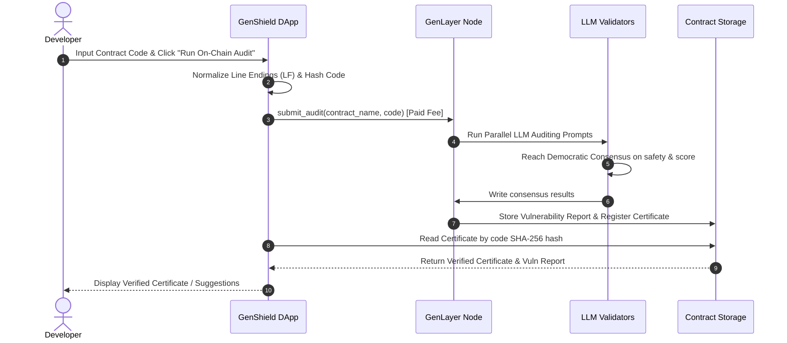

# 🛡️ GenShield On-Chain Intelligent Auditor

GenShield is an **Intelligent Contract** built on the **GenLayer** blockchain that performs decentralized, on-chain smart contract auditing. By leveraging LLM-based validator execution, GenShield reviews Python smart contracts for prompt injections, safety vulnerabilities, typing/storage errors, and sandbox violations, registers verifiable audit certificates on-chain, and provides detailed correction advice directly to developers.

---

## 🚀 Key Features

* **On-Chain AI Consensus**: Reaches consensus across multiple LLM validator nodes to determine safety (`is_safe` boolean consensus) and rates the quality of the contract code (average numeric score consensus).
* **Vulnerability & Fix Registry**: Stores structured vulnerability reports—including line numbers, severity levels, issue descriptions, and exact code corrections—directly in the contract storage.
* **Dual Network support**: Fully deployed and verified on both **GenLayer Studionet** and **GenLayer Bradbury Testnet**.
* **Seamless Wallet Synchronization**: Features a premium glassmorphic React frontend that automatically prompts your browser wallet (MetaMask, Rabby, etc.) to switch networks when you toggle target networks, and vice-versa.
* **Client-Side Fallback Static Analyzer**: Runs pre-screening checks locally for syntax, bracket balance, missing dependencies, or improper persistent storage types, providing instant feedback even during network timeouts.

---

## 📊 How it Works



---

## 📂 Codebase Architecture

```text
├── contracts/
│   └── genshield.py            # Intelligent Contract code (GenLayer Python Contract)
├── tests/
│   └── direct/
│       └── test_genshield.py   # Automated pytest suite in direct simulation mode
├── frontend/
│   ├── src/
│   │   ├── App.jsx             # DApp UI layout, wallet connections, & audit handler
│   │   ├── main.jsx            # RainbowKit & Wagmi configuration (Studionet & Bradbury)
│   │   └── index.css           # Premium vanilla CSS styling system
│   ├── index.html              # Entrypoint & favicon
│   └── vercel.json             # Routing rules for Vercel SPA hosting
├── deploy_studionet.py         # Deployment script for Studionet
├── deploy_bradbury.py          # Deployment script for Bradbury Testnet
├── verify_studionet.py         # Integration verification test for Studionet
├── verify_bradbury.py          # Integration verification test for Bradbury Testnet
├── deployed_addresses.json     # Tracking file for active contract deployments
└── requirements.txt            # Python environment dependencies
```

---

## 📍 Deployed Contracts

| Network | Chain ID | Contract Address |
| :--- | :--- | :--- |
| **GenLayer Studionet** | `61999` | `0x69E895F178CdF05b3C70e97289f31e3E79A9E4Ef` |
| **GenLayer Bradbury Testnet** | `4221` | `0x774110477436aBe7fA9324e8AF37F2b434cc1207` |

---

## 🛠️ Installation & Setup

### Prerequisites
* Python `3.13`
* Node.js `20+` & npm

### 1. Smart Contract & Testing Setup
1. Clone the repository and navigate to the project root:
   ```bash
   git clone https://github.com/0xnald/GenShield.git
   cd GenShield
   ```
2. Install Python dependencies:
   ```bash
   pip install -r requirements.txt
   ```
3. Run the automated test suite in direct mode:
   ```bash
   pytest
   ```

### 2. Frontend DApp Setup
1. Navigate to the `frontend` directory:
   ```bash
   cd frontend
   ```
2. Install npm dependencies:
   ```bash
   npm install
   ```
3. Create a `.env` file in the `frontend` directory:
   ```env
   VITE_WALLETCONNECT_PROJECT_ID=your_walletconnect_project_id
   VITE_GENSHIELD_CONTRACT_ADDRESS=0x69E895F178CdF05b3C70e97289f31e3E79A9E4Ef
   ```
4. Start the development server:
   ```bash
   npm run dev
   ```

---

## 🌐 Deploying to Vercel

The frontend is fully optimized for **Vercel** hosting:
1. Import the repository in Vercel.
2. Set the **Root Directory** to `frontend`.
3. Add the following **Environment Variables**:
   * `VITE_WALLETCONNECT_PROJECT_ID` (Your WalletConnect Project ID for RainbowKit)
   * `VITE_GENSHIELD_CONTRACT_ADDRESS` = `0x69E895F178CdF05b3C70e97289f31e3E79A9E4Ef`
   * `VITE_GENSHIELD_BRADBURY_ADDRESS` = `0x774110477436aBe7fA9324e8AF37F2b434cc1207`
4. Click **Deploy**. SPA redirects will be handled automatically by the included `vercel.json` routing configuration.

---

## 📄 License
This project is licensed under the MIT License.
